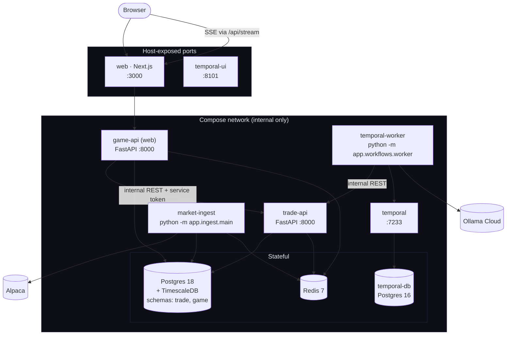
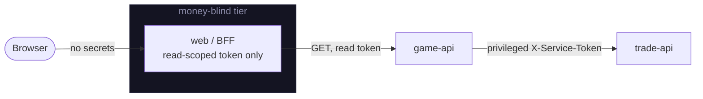

# 02 · Architecture

This is the runtime topology: the processes that make up Neuromancing, how they talk, where state lives, and the security boundaries. For the *why* behind the big choices, see [12 · Decisions](12-decisions.md); for the product framing, [01 · Overview](01-overview.md).

## Processes

Everything runs as one Docker Compose stack. Two Python images: `trade-api` builds one; `game-api` builds a second image that serves **three** roles (Temporal worker, market-ingest, and its own API) via different commands.

| Process | Image / command | Responsibility |
|---|---|---|
| `web` | `web/Dockerfile` | Next.js site + BFF. **Only host-exposed app port (3000).** |
| `game-api` | game image · `uvicorn app.main:app` | Public read API + SSE. Internal only. |
| `trade-api` | trade image · `uvicorn app.main:app` | Accounts/orders/positions/strategies. Internal only. |
| `temporal-worker` | game image · `python -m app.workflows.worker` | Runs the decision + maintenance workflows/activities. |
| `market-ingest` | game image · `python -m app.ingest.main` | Alpaca (or synthetic) → bars/quotes. |
| `temporal` + `temporal-ui` | `temporalio/auto-setup`, `.../ui` | Orchestration engine; UI on host **:8101**. |
| `db` | `timescale/timescaledb:latest-pg18` | System of record. Internal only. |
| `redis` | `redis:7-alpine` | Pub/sub, hot cache, budget counters. |
| `temporal-db` | `postgres:16-alpine` | Temporal's own store (separate from app data). |

**Only `web` (3000) and `temporal-ui` (8101) publish host ports.** Everything else is reachable only inside the Compose network — deliberately, to keep the surface minimal and avoid clashing with any host services on the usual ports. Named volumes: `pgdata`, `redisdata`, `temporaldb`, `bardata`.

## How they communicate

Three distinct channels, each chosen for a reason:

1. **Internal REST (the seam):** `game-api` → `trade-api` over plain HTTP inside the network, carrying a **privileged `X-Service-Token`** for any state-mutating call (place order, mark-to-market, create/seed/evaluate strategy). This is the load-bearing boundary: everything trade-related goes through it, so the sim backend can later be swapped for a real Alpaca Broker adapter without game-api changing. The only client is `game-api/app/trade_client.py`.
2. **Temporal (durable orchestration):** the worker connects to `temporal:7233`; Schedules fire the decision + maintenance workflows. Temporal owns retries, timeouts, idempotency, and replay. See [04 · The decision tick](04-decision-tick.md) and [06 · Orchestration](06-orchestration.md).
3. **Redis (pub/sub + hot state):** channels `feed` / `social` / `leaderboard` fan out to SSE ([09 · Realtime](09-realtime.md)); keys hold latest quotes (`quote:{symbol}`), the leaderboard cache/sorted-set, and the LLM budget counters (`llm:tok:*`, `llm:fallback:*`).

## State: one Postgres, two schemas

Both services point at the **same Postgres cluster** but each owns a schema via `MetaData(schema=...)`:

- **`trade`** (owned by trade-api): accounts, positions, orders, fills, `equity_snapshot` *(Timescale hypertable)*, strategies, strategy signals.
- **`game`** (owned by game-api): agents, personas, decisions, leaderboard snapshots, feed events, Chirp posts, donations. (Price bars are **no longer** in Postgres — they live in the [two-tier price store](08-market-data.md).)

Migrations run **trade first, then game** (each Alembic env creates its own schema + version table). There are **no cross-schema foreign keys** — links are soft string refs (`game.agent.account_ref` ↔ `trade.account.external_ref`). One deliberate, explicit **cross-schema read** remains, kept behind a single helper:

- `game-api` reads `trade.account` + `trade.equity_snapshot` for the leaderboard/equity curves → `game-api/app/leaderboard.py`, `reads.py`.

(The former trade→game read of `game.price_bar` for strategy evaluation is **gone**: bars now come from the shared `price_store`, so trade-api no longer couples to the game schema.)

**All mutation of trade state from game-api goes through the HTTP seam** (`trade_client.py`), never a direct DB write. Full schema detail in [03 · Data model](03-data-model.md).

## Security posture

- **Money-blind BFF.** The Next.js tier holds only `GAME_API_PUBLIC_TOKEN` (read-scoped). The privileged `TRADE_API_SERVICE_TOKEN` lives only in server-side game-api / temporal-worker. A full compromise of the Node tier can't move funds or place orders. See [10 · Web](10-web.md).
- **Service token** (`trade-api/app/security.py::require_service_token`, constant-time compare) guards every mutating trade-api endpoint.
- **Deterministic guardrails** bound what the LLM can do before an order is ever placed ([07 · Agent brain](07-agent-brain.md)).
- **Secrets are host-local**: `.env` is never committed; it's maintained by hand on each host (see `.env.example`).
- **No crypto private keys** anywhere in the runtime — donation tallying is watch-only by design.

## The two cross-cutting loops

Two Temporal Schedules drive everything (details in [04](04-decision-tick.md) and [06](06-orchestration.md)):

- **Per-agent decision tick** — one Schedule per agent at its cadence → strategy-eval → gates → LLM management → guardrails → orders → persist → SSE.
- **Maintenance refresh** — every 15s → mark all accounts to market → rebuild the leaderboard → publish.

Market data flows independently through `market-ingest` into the two-tier price store — Redis hot cache (recent bars + quotes) + a DuckDB-over-Parquet archive (history) — which both loops read via the shared `price_store`. See [08 · Market data](08-market-data.md).
