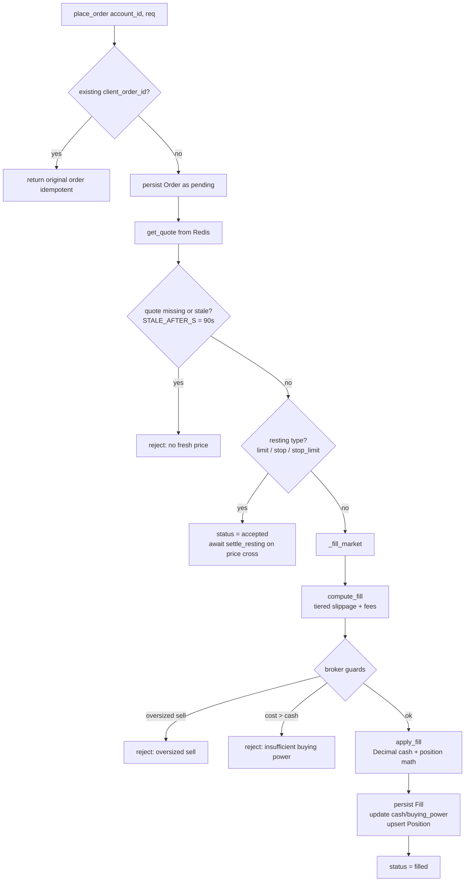
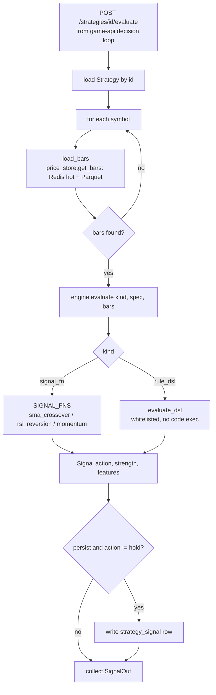

# 05 — Trading System (`trade-api`)

`trade-api` is the execution and strategy service: it owns brokerage accounts, orders, positions, mark-to-market equity, and a deterministic strategy engine. Every fill is priced against real Alpaca quotes (relayed through Redis by `market-ingest`) but settled inside a simulated, long-only cash ledger, so the whole system can run with no real money and no external order router. The service is built around one load-bearing seam — the pluggable **`Broker`** interface — so today's `SimBroker` can later be swapped for a live `AlpacaBroker` without the game layer changing.

Related docs: [data model](03-data-model.md) · [the tick](04-decision-tick.md) · [agent brain](07-agent-brain.md).

---

## 1. The `Broker` seam

`trade-api/app/brokers/base.py` defines the abstract `Broker` (an `ABC`). This is the intentional swap point: `SimBroker` implements it now; a future `AlpacaBroker` implements the *same* interface against Alpaca's Broker API, and nothing upstream (routers, game-api) has to change. Keep this interface stable and backend-agnostic.

Abstract methods (all `async`):

| Method | Purpose |
| --- | --- |
| `create_account(external_ref, starting_cash, base_currency="USD")` | Open an account keyed by an external reference. |
| `get_account(account_id)` | Fetch by internal id. |
| `get_account_by_ref(external_ref)` | Fetch by the caller's own reference. |
| `place_order(account_id, req)` | Submit an `OrderCreate`; returns the resulting `Order`. |
| `cancel_order(order_id)` | Cancel a pending/accepted order. |
| `get_order(order_id)` | Fetch a single order. |
| `list_orders(account_id, limit=100, offset=0, exclude_rejected=False)` | Paginated order history. |
| `list_positions(account_id)` | Open positions for an account. |
| `mark_to_market(account_id, marks)` | Snapshot equity given latest marks. |

`SimBroker` (`trade-api/app/brokers/sim.py`) also exposes `settle_resting(symbol)`, which is not on the ABC — it is an implementation detail of the simulated matcher (see §2.3) that a live broker would not need.

The broker is wired in via `trade-api/app/deps.py` (`get_broker` yields a `SimBroker` bound to the request's DB session and a shared Redis client), so switching backends is a one-line dependency change.

---

## 2. `SimBroker` — the simulated cash brokerage

`SimBroker` is **long-only** and models a **cash account**: `buying_power == cash_balance` at all times (both are set to the same value on every fill). No shorting, no margin.

### 2.1 `place_order` — idempotency, price freshness, routing

`place_order` (`sim.py:110`) proceeds in order:

1. **Idempotency.** It looks up any existing order for `(account_id, client_order_id)`. If found, it returns that original order untouched — a retried submit never double-fills.
2. **Lock + persist as `pending`.** It row-locks the account (`_lock_account`, `SELECT … FOR UPDATE`) so a concurrent position-monitor exit can't race on cash/positions, then creates and flushes a new `Order` row. The order's `stop_loss_pct`/`take_profit_pct`/`trailing_stop_pct` are **clamped** on intake (`_clamp_pct`: `sl,trail ∈ (0,0.9)`, `tp ∈ (0,5)`; ≤0 → dropped).
3. **Fresh-price gate.** It reads the latest quote via `get_quote` (`trade-api/app/prices.py`). If the quote is missing **or** `quote.stale` is true, the order is **rejected** with reason `"no fresh price for symbol"`. Staleness is defined in `prices.py` by `STALE_AFTER_S = 90.0` — a quote whose timestamp is more than 90 seconds old will not be filled against.
4. **Routing by order type.** Resting types (`limit`, `stop`, `stop_limit`, the `_RESTING_TYPES` set) are marked `accepted` and left to be filled later by the poller (§2.3). Everything else (market) is filled immediately via `_fill_market`.

### 2.2 `_fill_market` — broker-side guard rails

`_fill_market` (`sim.py:157`) prices the fill with `compute_fill` (§3), loads the current `PositionState`, then applies **defense-in-depth guards** on top of any guardrails the game layer already enforces:

- **Oversized sell:** a `sell` whose fill qty exceeds the held position is rejected — `"oversized sell (long-only)"`.
- **Insufficient buying power:** a `buy` whose total cost (`qty * price + fees`) exceeds `cash_balance` is rejected — `"insufficient buying power"`.

If the guards pass, it calls `apply_fill` (§4) for the cash/position math, then persists a `Fill` row (qty, price, fees, `slippage_bps`), updates `cash_balance` and `buying_power` to the new cash, upserts the `Position` (weighted-average entry), and marks the order `filled` with `filled_at`.

On a **buy**, it also transfers the order's exit config onto the position: if the buy took the position from `qty 0 → >0` it **resets** the levels (never inherits a previously-closed position's stale config) and sets `high_water_price` to the fill price; if it's **averaging** into an existing position it overrides only the percents the new order specified and sets `high_water_price = max(existing, fill_price)`. See §2.5.

### 2.3 Resting orders — `settle_resting`

Limit and stop orders sit in `accepted` until a price cross is detected. `settle_resting(symbol)` (`sim.py:231`) is called by the resting-order poller on each new quote for a symbol: it fetches the fresh quote (bailing on missing/stale), scans all `accepted` orders on that symbol, and for each one asks `limit_stop_crosses` (§3) whether the current price has crossed the limit/stop. Crossed orders are filled through the same `_fill_market` path (so they get the same guards, slippage, and fees) and the count filled is returned. (This same "fresh quote → cross check → fill via `_fill_market`" pattern is what `settle_exits` in §2.5 reuses for position-level stops.)

### 2.4 `mark_to_market`

`mark_to_market(account_id, marks)` (`sim.py:256`) values open positions with `positions_value` (§4) against the supplied marks, computes cost basis, cash, total equity, and splits P&L into realized (`total − starting_equity − unrealized`) and unrealized (`positions_value − cost_basis`). It writes an `EquitySnapshot` row and flags `is_stale` if any held symbol is missing from `marks`.

### 2.5 Position-level exits — `settle_exits`

`settle_exits(tick_id)` is the executor behind the deterministic [position monitor](04-decision-tick.md#the-position-monitor-deterministic-exits). It selects positions with `qty > 0` and any exit level set (backed by the `ix_position_exit_watch` partial index), groups them **by account**, and processes each account under a `SELECT … FOR UPDATE` lock (consistent order with `place_order`, so the monitor and decision ticks never race). Per position it re-reads state under the lock, fetches a **fresh** quote (missing/stale → skip — this is why after-hours equities are left alone), ratchets `high_water_price`, and calls the pure `evaluate_exit` (§3). On a hit it market-sells the full qty through `_fill_market` (`client_order_id = exit:{position_id}:{tick_id}`, idempotent), clears the position's exit config, and returns `{position_id, account_ref, symbol, reason, qty, price, realized}` for each exit. Because it's a market sell at the fill quote ± slippage, the realized figure reflects the *actual* fill, which may differ from the level on a gap.

---

## 3. Matching engine (`engine/matching.py`)

Pure, deterministic, side-effect-free pricing logic — exhaustively unit/property testable, imported by `SimBroker` but never touching the DB or Redis itself.

### Tiered slippage

Slippage is charged **adverse to the taker** and scales with order notional (bigger orders "move" the simulated market more). `_SLIPPAGE_TIERS` / `slippage_bps_for`:

| Order notional (USD) | Slippage |
| --- | --- |
| `< 1,000` | 1 bps |
| `< 10,000` | 3 bps |
| `< 100,000` | 8 bps |
| `≥ 100,000` | 15 bps (`_SLIPPAGE_TOP_BPS`) |

### Fees

`_FEE_BPS` per side by asset class: **equity = 0 bps**, **crypto = 10 bps** (unknown classes default to 0).

### `compute_fill`

`compute_fill(quote, side, asset_class, qty=None, notional=None)` prices a market fill. Exactly one of `qty` / `notional` must be given. It:

- takes the reference price from `quote.side_price(side)` (buy → ask, sell → bid, else last);
- applies **adverse** slippage: `fill_price = ref * (1 + slip)` for buys, `ref * (1 - slip)` for sells;
- for **notional** orders, converts to a **fractional qty** at the slipped fill price (`notional / fill_price`);
- computes fees off gross notional and returns a `FillQuote` (qty, price, `slippage_bps`, fees, gross notional).

All monetary results use `Decimal` via the shared `quantize_money` / `quantize_qty` helpers.

### `limit_stop_crosses`

`limit_stop_crosses(order_type, side, limit_price, stop_price, quote)` decides whether a resting order should fill now:

- **limit:** buy fills when `ref ≤ limit`, sell when `ref ≥ limit`.
- **stop:** buy triggers when `ref ≥ stop`, sell when `ref ≤ stop` (then fills at market).
- **stop_limit:** must trigger the stop *and* satisfy the limit.

### `evaluate_exit`

`evaluate_exit(avg_entry, last, high_water, stop_loss_pct, take_profit_pct, trailing_stop_pct)` is the pure (side-effect-free, unit/property-tested) decision behind `settle_exits` (§2.5). It ratchets the trailing high-water monotonically (`high_water = max(high_water, last)`), takes the **tighter (higher) of the fixed stop** `avg_entry·(1−sl)` **and the trailing stop** `high_water·(1−trail)`, and returns an `ExitDecision(should_exit, reason, high_water)`: exit `stop_loss`/`trailing_stop` when `last ≤` that effective stop, else `take_profit` when `last ≥ avg_entry·(1+tp)`. Levels are fractions of average entry, so they survive averaging (which moves `avg_entry`).

---

## 4. Portfolio math (`engine/portfolio.py`)

The P&L spine — **pure `Decimal`, no float ever**, property-tested. Long-only.

- **`apply_fill(cash, position, side, qty, price, fees)`** returns a `FillOutcome(cash, position, realized_pnl)`.
  - **Buy:** subtracts cost (`qty*price + fees`) from cash and rolls the position into a **weighted-average entry** over the combined long; realized P&L is zero.
  - **Sell:** adds proceeds (`qty*price − fees`) to cash, **realizes P&L** = `qty*(price − avg_entry) − fees`, and reduces qty (avg entry unchanged while a long remains, reset to zero when flat). **Raises `ValueError` on an oversized sell** (`qty > position.qty`) — the last line of defense against selling more than is held.
- **`positions_value(marks, positions)`** returns the mark-to-market value of open positions, summing `qty * mark` for every symbol present in `marks`.

---

## 5. Strategy engine (`app/strategies/`)

The strategy engine turns price history into a single trading `Signal`. It is deterministic and pure so strategies are fully backtestable and reproducible.

### `base.py` — core types

`Bar(ts, open, high, low, close, volume)` and `Signal(action, strength, features)` where `action ∈ {buy, sell, hold, exit}` and `strength` is a `0..1` conviction. **Indicators and signals run in `float`, not `Decimal`** — a signal is *not money*, so speed wins over exactness here (contrast with §3/§4). `HOLD` is the shared no-op signal.

### `indicators.py` — pure indicators

Two layers. The **close-list** registry `INDICATORS` (`sma`, `ema`, `rsi` default period 14, `roc` as a fraction) feeds the legacy `rule_dsl`/`signal_fn` kinds. A **bar-aware layer** (`compute_indicator`) feeds the `indicator_dsl` engine below: it derives a series from `Bar`s by `source` (`close/open/high/low/hlc3/volume`) and adds **`macd`** (line/signal/hist), **`bollinger`** + scalar **`bbpercent`** (%B), **`atr`** (true range over OHLC), and **`vwap`** (rolling, OHLCV). Multi-valued indicators return a dict; a condition picks a `field` (`scalar_value`).

### `library.py` — house signal functions

Three deterministic `signal_fn` strategies, each `(closes, spec) → Signal`. **All three are event-driven**: they compare the current bar's indicator against the previous bar's and emit a signal only on the *transition* into a condition, returning `HOLD` while it merely persists. This is deliberate — a state-based strategy that re-emits the same signal every tick would invoke the LLM manager needlessly (see [the decision tick](04-decision-tick.md)).

- **`sma_crossover`** — buy on fast-over-slow cross up, exit on cross down.
- **`rsi_reversion`** — buy when RSI **crosses down through** the low band, exit when it **crosses up through** the high band (not every tick it stays there).
- **`momentum`** — buy/exit when `roc` **crosses through** ±threshold.

Registered in `SIGNAL_FNS`. (The `rule_dsl` strategy below is, by contrast, *state-based* — its declarative `buy_when` is true for as long as the condition holds — so it relies on the game-api **actionability filter** to avoid redundant LLM calls; see [04](04-decision-tick.md).)

### `dsl.py` — legacy rule DSL

The original declarative kind: **no code execution**, only known `INDICATORS` and the operators `<, <=, >, >=, ==`. A spec is `buy_when`/`exit_when` groups of single-level `all`/`any` conditions; `evaluate_dsl` returns a strength-`0.6` buy/exit `Signal` or `HOLD`. It is **state-based** (fires while a condition holds) and close-only — superseded by `indicator_dsl` for new work, but kept for back-compat.

### `spec.py` + `composed.py` — the `indicator_dsl` model (YAML-authored)

The configurable strategy grammar (TODO #2). A strategy is authored in **YAML** as: named **indicators** (each with an OHLCV `source` **and its own `timeframe`**), named **states** (a level/zone `{indicator, op, value|other}` or a **crossing** `{indicator, cross: above|below, …}`), and `buy_when`/`exit_when` **rule groups** (nestable `all`/`any`/`not` over state names or inline conditions), plus an optional `type` archetype, `base_timeframe`, and a `strength` map.

- **`spec.py::validate_spec`** is the single fail-closed gate (Pydantic): unknown fn/op/source/field/cross, dangling references, bad params, or an out-of-range timeframe are **rejected on create and at catalog load** — closing the old "spec stored blindly" gap. It returns the canonical dict stored in `spec` (JSONB). YAML is authoring-only; the DB holds JSON.
- **`composed.py::evaluate_composed(spec, bars_by_tf)`** is pure/sync. Two invariants: **as-of alignment** (an indicator on timeframe `T` uses only bars *closed* as of the eval instant, `bar_open + T ≤ cutoff` — Alpaca stamps bars at OPEN, so no lookahead), and **event-driven at base resolution** (the whole group is evaluated at the current base step and the previous one; a signal fires only on the group's **false→true transition**, so a higher-tf condition contributes exactly one fire — no per-base-step spam). `strength` maps one indicator's value linearly into `[0,1]` (default 0.6).

### `engine.py` — dispatch + catalog

`evaluate(kind, spec, bars)` handles the single-series kinds (`signal_fn` → `SIGNAL_FNS`; `rule_dsl` → `evaluate_dsl`; `indicator_dsl` wrapped single-tf); **`evaluate_multi(kind, spec, bars_by_tf)`** is the multi-timeframe path the evaluate endpoint uses for `indicator_dsl`. The house catalog is **YAML files under `strategies/catalog/*.yaml`** (the single source of truth), loaded + validated by `list_house_strategies()` — the four legacy strategies (names/specs unchanged) plus multi-indicator, multi-timeframe showcases (e.g. "MACD Trend + RSI Pullback"). A malformed catalog file fails seed loudly.

### `backtest.py` — long/flat replay

`backtest(kind, spec, bars, starting_cash=10000)` replays single-series strategies bar-by-bar under a **long/flat** model (35-bar warmup) → `bars, trades, win_rate, total_return, max_drawdown, final_equity`. **`backtest_multi`** does the same for `indicator_dsl`, stepping "now" through the **base** timeframe while passing higher-tf series in full — the composed evaluator's as-of filter drops any not-yet-closed bar, so the backtest has **no lookahead**. These reproducible metrics back the [redacted].

### `data.py` — the bar reader (via the shared price store)

`load_bars(session, symbol, timeframe="1m", limit=200)` is `trade-api`'s single bar reader. It calls `price_store.get_bars(symbol, timeframe, limit)` — recent bars from the Redis hot cache, deeper windows from the DuckDB-over-Parquet archive — returning bars in chronological order. This **replaced** the old cross-schema read of `game.price_bar`, so trade-api **no longer couples to the game schema** at all. The `session` arg is retained for call-site compatibility (unused). See [08 · Market data](08-market-data.md).

---

## 6. REST API

Defined in `app/main.py` (plus `GET /healthz`). Mutating endpoints depend on `require_service_token` (§7), marked 🔒 below.

**Accounts** (`routers/accounts.py`)

| Method | Path | Notes |
| --- | --- | --- |
| `POST` | `/accounts` | 🔒 Create (idempotent on `external_ref`). |
| `GET` | `/accounts/{account_id}` | Fetch by id. |
| `GET` | `/accounts/by-ref/{external_ref}` | Fetch by external ref. |

**Orders** (`routers/orders.py`, prefix `/accounts/{account_id}/orders`)

| Method | Path | Notes |
| --- | --- | --- |
| `POST` | `""` | 🔒 Place an order. |
| `GET` | `""` | List orders (`limit`, `offset`, `exclude_rejected`). |
| `GET` | `/{order_id}` | Fetch one order. |
| `GET` | `/{order_id}/fills` | Fills for an order. |
| `DELETE` | `/{order_id}` | 🔒 Cancel an order. |

**Positions & equity** (`routers/positions.py`, prefix `/accounts/{account_id}`)

| Method | Path | Notes |
| --- | --- | --- |
| `GET` | `/positions` | Open positions (incl. exit levels). |
| `POST` | `/mark-to-market` | 🔒 Snapshot equity from supplied marks. |

**Exits** (`routers/positions.py`, global `exits_router`)

| Method | Path | Notes |
| --- | --- | --- |
| `POST` | `/positions/settle-exits` | 🔒 Enforce stop/take/trailing exits across all accounts (driven by the position-monitor). |

**Strategies** (`routers/strategies.py`, prefix `/strategies`)

| Method | Path | Notes |
| --- | --- | --- |
| `POST` | `""` | 🔒 Create a strategy. |
| `POST` | `/seed` | 🔒 Idempotently seed the house catalog. |
| `GET` | `""` | List strategies. |
| `GET` | `/{strategy_id}` | Fetch one. |
| `POST` | `/{strategy_id}/evaluate` | 🔒 **Called by the game-api decision loop.** |
| `POST` | `/{strategy_id}/backtest` | 🔒 Backtest a stored strategy. |
| `POST` | `/backtest` | 🔒 **Ad-hoc backtest** of an unpersisted spec over an optional `window {start,end}` — the [deep agent](14-deep-agents.md) iterates on this. |
| `POST` | `/{strategy_id}/status` | 🔒 Transition lifecycle status (draft/active/**retired**). |

The **`POST /strategies/{id}/evaluate`** endpoint is the integration point the [decision tick](04-decision-tick.md) drives: for each requested symbol it loads recent bars from the price store and evaluates the strategy — a single-series kind uses the request's `timeframe`, while an `indicator_dsl` strategy loads **each timeframe its indicators declare** (deduped, hot-cache served) and its own timeframes win over the request's. When `persist` is set it writes non-`hold` `strategy_signal` rows for the [agent brain](07-agent-brain.md) to act on. `POST /strategies` and `/seed` now **validate the spec** before storing (fail-closed), and `create` accepts `owner_type`/`owner_ref`/`version`/`status` — the once-dormant `StrategyStatus` (draft/active/retired) + `owner_type` (house/user) lifecycle is now wired for deep-agent adoption: an adopted evolved strategy is `owner_type=user`/`active`, the superseded self-owned one goes `retired`. See [14 · Deep agents](14-deep-agents.md).

---

## 7. Service-token auth

`app/security.py` `require_service_token` gates every mutating endpoint. It reads the `X-Service-Token` header and compares it to the configured `trade_api_service_token` with `hmac.compare_digest` (constant-time). Only server-side callers (game-api, temporal-worker) hold this token; the thin Next.js BFF never does. Read-only endpoints are unauthenticated at this layer.

---

## 8. Diagrams

### 8.1 `place_order` → fill

### 8.2 Strategy `evaluate` flow

