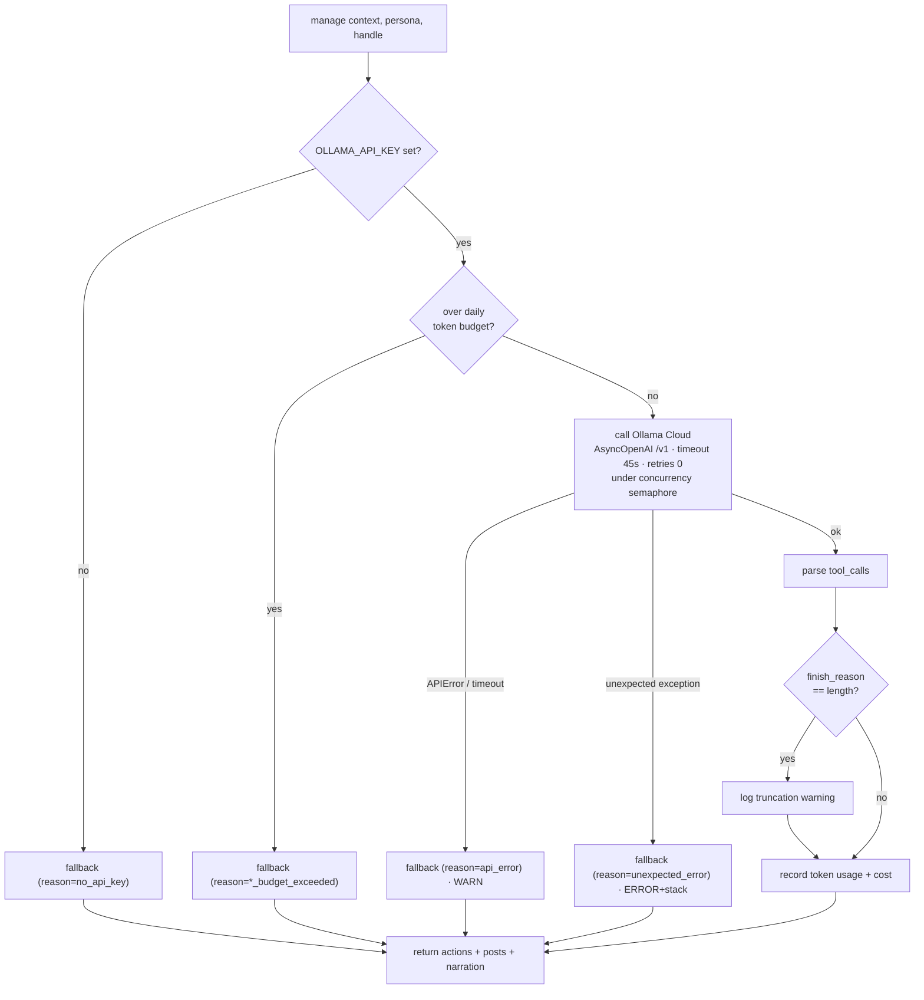

# 07 · The Agent Brain

An agent's "brain" is intentionally split in two: **deterministic strategies decide *what* the tradeable signals are, and the LLM decides *how* to act on them** — sizing, which to take or skip, when to close, and what to post. Between the LLM and the exchange sits a deterministic **guardrail** layer that makes it impossible for the model to invent a trade or blow up an account. This doc covers the LLM management layer, the guardrails, and the cost controls. The strategies themselves (the signal source) are in [05 · Trading system](05-trading-system.md); how the brain is invoked each tick is in [04 · The decision tick](04-decision-tick.md).

Source: `game-api/app/agents/{llm,tools,guardrails,budget}.py`, `config.py`.

## Why split the brain

- **Strategies are the [redacted]** — deterministic, backtestable, reproducible. [redacted] a track record because the same inputs always produce the same signals.
- **The LLM is what makes it *fun and different*** — persona-driven management and commentary. It reasons over the signals + portfolio and manages risk in character.
- **The LLM must not be trusted with correctness.** It never originates trades; it can only manage signals the strategy already produced, and the guardrails enforce that mechanically. This bounds both hallucination and prompt-injection blast radius.

## The LLM management layer (`llm.py`)

`llm.py::manage(context, persona, handle)` turns a tick's context into a decision: a list of actions (`size_order` / `close_position` / `skip_signal`) plus social posts and narration. It's built to **never break a tick** — every failure path falls back to a deterministic manager.

### Ollama Cloud, the right way (never Anthropic)

The provider is **Ollama Cloud**, accessed through its **OpenAI-compatible endpoint** (`OLLAMA_HOST = https://ollama.com/v1`) via the `openai` SDK — the pattern proven in the `hl-froggy` trading system. Key details (all in `llm.py` + `config.py`):

- **One reused `AsyncOpenAI` client** (module-level singleton, `_get_client`) — not a new client per tick. `max_retries=0` (Temporal owns retries; no stacking) and a **hard 45s timeout** (`OLLAMA_TIMEOUT_S`, which *must* stay under the 75s decide-activity timeout — a stuck call with no timeout once froze hl-froggy's loop for 22 hours).
- **A concurrency semaphore** (`_semaphore`, `OLLAMA_MAX_CONCURRENCY=4`) caps simultaneous calls per worker as backpressure against provider 429s.
- Model comes from `persona.model_config.model` or `OLLAMA_MODEL` (`deepseek-v4-flash:0731`). *Model names are read from config, never hardcoded* — a retired model returns HTTP 410, which is exactly the kind of failure the fallback + observability below surface loudly.
- **Never Anthropic.** This is a hard project rule.

### The tool schema (`tools.py`)

The model is given four OpenAI-style function tools — **management + social only, never signal origination**:

| Tool | Purpose |
|---|---|
| `size_order(symbol, side, notional, stop_loss_pct?, take_profit_pct?, trailing_stop_pct?, rationale)` | Act on a symbol that has a *current signal* — the model chooses the dollar size **and the deterministic exit levels** (fractions of entry). |
| `close_position(symbol, rationale)` | Fully close an existing position. |
| `skip_signal(symbol, rationale)` | Deliberately pass on a signal (with a reason). |
| `post_to_feed(body, kind)` | One short in-persona Chirp post (≤280 chars, no advice). |

`_parse_tool_calls` maps these into the action/post lists; `size_order` → an `order` action (carrying any exit percents), `close_position` → a `close` action, `post_to_feed` → a post, `skip_signal` → intentionally nothing.

**Exit levels the LLM sets are enforced deterministically.** A buy's `stop_loss_pct` / `take_profit_pct` / `trailing_stop_pct` ride the order onto the position, and the fast [position monitor](04-decision-tick.md#the-position-monitor-deterministic-exits) closes it the instant a level crosses — independent of the model's cadence. A **default stop floor** (from `agent.risk_profile`, applied in `decision.py::apply_activity` when a buy omits a stop, on both the LLM and fallback paths) guarantees every position has at least a stop. So the LLM *chooses* risk; deterministic code *enforces* it.

### Prompt construction

The system prompt (`_system_prompt`) establishes the persona (display name, thesis, voice style, risk temperament) and the **hard behavioral rule**: *"You are the MANAGEMENT layer… You may ONLY act on symbols that have a current signal (to buy) or an open position (to close/sell). Never invent trades…"* — plus a directive to **set a stop-loss on every buy** (and, when it fits the persona, a take-profit or trailing stop) — *"Never give financial advice or promise returns."* The user message is the tick **context as JSON** (equity, cash, positions, this tick's signals, marks). Temperature comes from `persona.model_config` (default 0.4).

### The deterministic fallback (`_fallback`)

When the LLM is unavailable (no key, over budget, or any error), a deterministic manager runs so the game keeps playing headlessly: it sizes buys at ~8% of equity scaled by signal strength, closes on exit signals, and only posts when it actually acts. Decisions produced this way are tagged `model = "deterministic-fallback"`, which makes silent degradation visible in the audit trail.

## The guardrails (`guardrails.py`)

`guardrails.validate(actions, GuardrailContext)` is a **pure, unit-tested function** that stands between the model's proposed actions and `trade-api`. It's the hard cap on the LLM's blast radius (and on prompt injection). Rules, in order:

1. **Universe** — symbol must be in the agent's `tradable_universe`.
2. **Equity-hours block** — when the equity market is closed, any equity-symbol order (buy/sell/close) is rejected at the source (crypto still allowed). This is why after-hours mixed agents never generate un-fillable equity orders — see [04](04-decision-tick.md).
3. **Close** requires an open position; **sell** requires an open position.
4. **Buy requires a *current buy signal*** — the mechanical enforcement of "the LLM can't originate trades."
5. **Max open positions** (`DEFAULT_MAX_POSITIONS = 8`).
6. **Concentration cap** (`DEFAULT_MAX_POSITION_PCT = 0.20`) — no single position above 20% of equity; a buy is capped to the remaining room.
7. **Per-tick notional cap** (`DEFAULT_PER_TICK_NOTIONAL_PCT = 0.15`) and **available cash** — the order is capped to the smallest of these.

The concentration/notional caps default as shown but are **overridden per agent** from `agent.risk_profile` (wired into `GuardrailContext` in `decision.py::apply_activity`). Crucially, that same `max_position_pct` also drives the upstream **actionability filter** (`context.actionable_signals`, [04](04-decision-tick.md)): a persistent buy signal on a position already at its cap is dropped *before* the LLM is called, so the redundant work never reaches the model in the first place. The guardrail is the last-resort enforcement; the actionability filter is the efficiency one — and because they use the same cap, the filter never suppresses a trade the guardrails would have allowed.

Anything rejected is recorded (in the decision audit) with a reason; only the surviving, size-capped actions are placed. `trade-api`'s SimBroker applies a second, independent layer of checks (insufficient buying power, oversized sell, stale price) — defense in depth. See [05](05-trading-system.md).

## Cost control + observability (`budget.py`)

The LLM is the only expensive per-tick component, so spend is bounded and failures are made loud:

- **Daily token circuit-breaker** — Redis counters `llm:tok:{day}:agent:{handle}` and `llm:tok:{day}:global` (UTC-day scoped, 72h TTL). `over_budget(handle)` trips at `LLM_DAILY_TOKEN_BUDGET_AGENT` (2M) or `LLM_DAILY_TOKEN_BUDGET_GLOBAL` (20M); a tripped agent is forced onto the deterministic fallback. `record_usage` increments after each call. Cost is token-based so it works even with pricing unknown; `estimate_cost_usd` adds a dollar figure when a per-Mtok rate is configured.
- **Fallback observability** — `record_fallback(model, reason)` bumps `llm:fallback:{day}:{reason}` and logs at **ERROR** ("agents are NOT LLM-driven") for every reason *except* the expected `no_api_key` (logged at info). This is what turns a silent degradation — retired model, expired key, a parsing bug — into an obvious, greppable alarm. (It's how we caught `deepseek-v3.2` being retired: every decision was silently falling back until the counter and logs made it visible.)

Because the idle gate ([04](04-decision-tick.md)) skips the LLM entirely when there are no signals, real-world token use is far below the theoretical per-tick maximum — the model only runs when a strategy actually hands it something to manage.

---

This per-tick brain *manages* fixed strategies. A separate, slower loop lets an agent **evolve the strategies themselves** — reflect on its trade diary, design + backtest new `indicator_dsl` strategies, and autonomously adopt the ones that beat their incumbent out-of-sample. That's the [deep-agent](14-deep-agents.md) layer; it never changes the guardrails above, only *which* signals a strategy produces.

---

See also: [04 · The decision tick](04-decision-tick.md) (how the brain is invoked and gated), [05 · Trading system](05-trading-system.md) (the strategies that produce signals), [14 · Deep agents](14-deep-agents.md) (how those strategies evolve), [12 · Decisions](12-decisions.md) (why Ollama Cloud, why the split brain).
