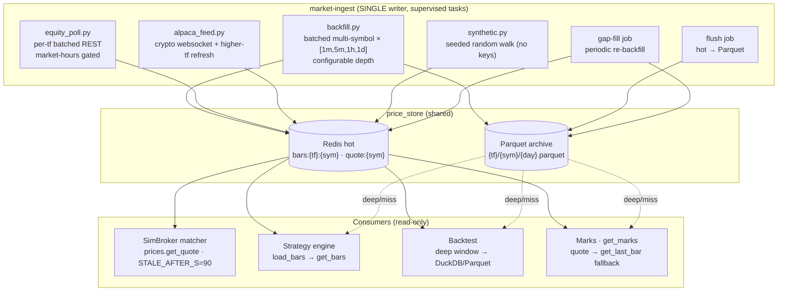

# Neuromancing — Market Data & the Price Platform

The `market-ingest` service is the **single writer** of price data for the game. It
runs a **live Alpaca** feed when `ALPACA_API_KEY` is set, or a **synthetic
random-walk** feed when it is not — so the entire game runs with zero API keys and
swaps to real market data the moment keys land. Both feeds write to the **two-tier
price store** (`neuromancing_shared/price_store.py`): a **Redis hot cache** for
recent bars + latest quotes, and a **DuckDB-over-Parquet archive** for history.
Downstream consumers (the [trading system](05-trading-system.md) matcher, the
strategy engine, and the [decision tick](04-decision-tick.md) context) read through
`price_store` without knowing which feed produced the data.

This platform (TODO #4a) replaced the original demo layer — a hardcoded 13-symbol
tech-heavy universe, 1-minute bars only, stored in a `game.price_bar` Timescale
hypertable read cross-schema. That table is **retired** (migration
`0002_drop_price_bar`); bars now live only in Redis + Parquet.

## The two-tier store (`neuromancing_shared/price_store.py`)

Shared by both services so there is exactly one implementation and one bar shape
(`{ts, open, high, low, close, volume}` dicts).

- **Redis hot** — `bars:{timeframe}:{symbol}` is a **sorted set** (score = epoch
  seconds, member = JSON bar), holding the most recent `PRICE_HOT_LEN` (default 500)
  bars per (timeframe, symbol), plus the latest quote at `quote:{symbol}`. Writes
  **dedup by ts** (a re-fetched bar overwrites, never duplicates) and **trim** to the
  cap. The live read path serves entirely from here — **no disk**.
- **Parquet archive** — closed history on the shared `bardata` volume, partitioned
  **by day**: `{BARDATA_DIR}/{timeframe}/{symbol}/{yyyy-mm-dd}.parquet` (a directory
  per symbol, so a query only ever reads that symbol's files). Files are written
  **atomically** (temp file + `os.replace`) and **only by the single ingest writer**,
  so readers never see a half-written file and there is no write contention. Bar `ts`
  is stored **naive-UTC** to keep DuckDB binding dependency-free (no `pytz`).
- **DuckDB** — an embedded, reused in-memory connection reads the Parquet glob
  (`read_parquet(...)`) for deep-history / backtest scans. Reader services mount
  `bardata` **read-only**; there is never a second writer.

### Read API

- **`get_bars(symbol, timeframe, limit)`** → the newest `limit` bars, ascending. Reads
  Redis hot first; if the window is deeper than the hot cache, it reads Parquet via
  DuckDB (bars older than the hot window) and **merges deduped by ts** (hot wins on
  overlap). A window that fits the hot cache never touches disk.
- **`get_last_bar(symbol, timeframe)`** → latest bar, **Redis-first** (Parquet only on
  miss), since it's on the hot marks/leaderboard path.

### Write API (ingest only)

- **`ingest_bars(symbol, tf, bars, *, archive=False)`** — the single write path:
  always updates Redis hot; when `archive` (backfill), also writes Parquet. Live
  polling passes `archive=False` and relies on the periodic flush job for durability,
  so the live path stays cheap.
- **`write_parquet` / `flush_to_parquet` / `flush_all`** — the durability side. The
  flush job persists hot → Parquet on a cadence.
- **`write_quote(symbol, ...)`** — the `quote:{symbol}` cache (unchanged contract,
  `QUOTE_TTL_S` ~26h).

## Runtime — the single writer (`ingest/main.py`)

`market-ingest` is `python -m app.ingest.main`. **Every task that writes bars runs
here** as a supervised in-process asyncio task with restart-on-error backoff — a
second writer anywhere would corrupt the Parquet archive. Tasks are **not** Temporal
activities for exactly this reason.

```
Live (ALPACA_API_KEY set):
  backfill (one-shot, background)   # warm history; does NOT block the live feed
  crypto-stream                     # 24/7 websocket: 1m bars + quotes
  crypto-higher-tf                  # periodic 5m/1h/1d crypto refresh
  equity-poll-{1m,5m,1h,1d}         # one task per tf, batched REST, market-hours-gated
  flush                             # Redis hot → Parquet durability
  gapfill                           # periodic short re-backfill (dedup makes it safe)

Synthetic (no key):
  synthetic                         # seeded random walk → Redis hot
  flush                             # → Parquet
```

## Flow



## Universe (`ingest/universe.py`)

The active **equity** universe is a named symbol list under `ingest/symbols/*.txt`,
selected by `PRICE_UNIVERSE` (default `diversified`):

- **`diversified.txt`** — ~150 **sector-balanced** US large/mid-caps (IT,
  communication, discretionary, staples, financials, health care, industrials,
  energy, materials, utilities, real estate) plus a few broad ETFs. This replaced the
  old tech-heavy 13-symbol list.
- **`russell1000.txt`** — **#4b, now populated**: the ~1000 largest US equities by market
  cap (a current, valid approximation of the Russell 1000; top-by-marketCap from a NASDAQ
  screener snapshot with preferred/class-share duplicates filtered). Selected via
  `PRICE_UNIVERSE=russell1000`. `market-ingest` skips any symbol Alpaca
  can't price, so a few stragglers degrade gracefully; for exact index membership, swap in
  the official iShares IWB holdings CSV tickers.
- List files: one ticker per line; `#` comments and blanks ignored; `include <name>`
  composes lists.
- **`DEFAULT_CRYPTO`** — `BTC/USD, ETH/USD, SOL/USD`. **`is_crypto`** (has a `/`)
  routes symbols between the stock/crypto Alpaca clients and controls synthetic
  volatility and the filesystem-safe path (`BTC/USD` → `BTC_USD`).
- **`seed_price(symbol)`** — a **deterministic** per-symbol starting price for the
  synthetic walk (crypto majors pinned; equities spread ~$20–$520 by a hash), so
  there is no hand-maintained seed table.

Ingest fetches prices for the **whole** universe; each agent trades a **curated
subset** (see `app/seed.py`) — the ingest universe and per-agent universes are
separate concerns.

## Timeframes

Each of `1m/5m/1h/1d` (`PRICE_TIMEFRAMES`) is fetched **natively from Alpaca**
(`ingest/tf.py::alpaca_tf`) for both backfill and live refresh — **never derived from
1m**. Deriving via bucketing risks session-alignment and partial-bucket mismatches, so
a strategy would see different bars live vs. in backtest; native fetch keeps them
identical. Live cadence is tiered (`PRICE_POLL_SECONDS`): 1m/min, 5m/5min, 1h/hour,
1d/day.

## Backfill (`backfill.py`)

Warms history so strategies act immediately instead of waiting ~35 min for live 1m
bars to accumulate.

- **Batched multi-symbol** requests (chunked to `PRICE_BATCH_SIZE`, throttled) across
  the universe × timeframes, writing Parquet + warming Redis hot via
  `ingest_bars(archive=True)`, and seeding the latest quote from each symbol's last
  bar close.
- **Depth is configurable per timeframe** (`PRICE_BACKFILL_DAYS`, default
  `1m:5,5m:20,1h:120,1d:365`) and runs as a **background one-shot** — it does **not**
  block the live feed; agents run on whatever is warmed.
- **Idempotent:** the store dedups by ts, so overlapping re-fetches and the periodic
  **gap-fill** (short-window re-backfill) are safe.
- ⚠️ **History availability depends on the Alpaca data feed/subscription.** IEX (free)
  history is limited, so deep 1m history may require SIP. Deep multi-year history for
  the evolving deep agents (#3) is a later, larger backfill.

## Equity poller (`equity_poll.py`)

Replaces per-symbol equity streaming. One supervised task per timeframe pulls the
latest bars for the whole equity universe via Alpaca's **batched multi-symbol** bars
endpoint (on the tf's cadence), appends to Redis hot (+ quote), and is **gated to
market hours** (`market_hours.equity_active`) so it doesn't hammer Alpaca after-hours.
Parquet durability is the flush job's job — the poller writes hot only.

## Crypto feed (`alpaca_feed.py`)

Crypto is few-symbol and 24/7, so it stays on the **websocket** (1m bars + quotes →
Redis hot) with supervised exponential-backoff reconnect. A periodic
`refresh_crypto_higher_tf` task pulls the latest 5m/1h/1d crypto bars (the websocket
only gives 1m).

## Synthetic feed (`synthetic.py`)

Runs with no keys: each `TICK_SECONDS = 5s` it fabricates one 1m bar + a fresh quote
per symbol into Redis hot (Parquet durability via the flush job). Uses a seeded RNG,
**continues from the last stored bar** (`get_last_bar`) so restarts don't snap the
walk, and falls back to `seed_price` on a cold store. Crypto is jumpier
(`vol=0.02` vs `0.008`).

## Consumption

- **Quotes → SimBroker matcher.** `trade-api/app/prices.py::get_quote` reads
  `quote:{symbol}` and stamps `stale` when `ts` is older than `STALE_AFTER_S = 90s`;
  the matcher **refuses to fill against a stale/missing quote**, so a dead feed halts
  fills rather than executing at a phantom price. (Unchanged — only the *bar* store
  moved.)
- **Bars → strategy engine.** `trade-api/app/strategies/data.py::load_bars` now calls
  `price_store.get_bars(symbol, timeframe, limit)` — **no more cross-schema read of
  `game.price_bar`**, so trade-api no longer couples to the game schema. `timeframe`
  is threaded end-to-end (`context.py` → `evaluate_strategy` → `EvaluateRequest`),
  defaulting to `1m` (full per-strategy tf selection is #2).
- **Bars → backtest.** Deep-history backtests pull long windows through the same
  `load_bars`, which reads Parquet via DuckDB below the hot window.
- **Marks (with a last-bar fallback).** `game-api/app/marks.py::get_marks` uses the
  latest Redis quote when present and **falls back to `get_last_bar`** (Redis-first,
  Parquet on miss) for any symbol whose quote is missing/expired — so held positions
  are always valued at a real last-known price, never **$0**. This is the fix for the
  overnight $0-mark artifact; keeping the fallback Redis-first keeps the hot path fast.

## Market hours (`market_hours.py`)

Unchanged. `equity_active(buffer_min=30)` sources NYSE sessions from Alpaca's calendar
(holidays/half-days/DST encoded), converts naive-ET → UTC, caches in-process (30-min
TTL), and returns `True` within `[open−buf, close+buf]`. **Fail-open**: on any
calendar error, or with no Alpaca key, it returns `True` so agents never sleep
forever. The equity poller and the equity-only sleep gate both use it.

## Config

`BARDATA_DIR`, `PRICE_HOT_LEN`, `PRICE_TIMEFRAMES`, `QUOTE_TTL_S` live on the **shared**
`BaseServiceSettings` (both services read Parquet). `PRICE_UNIVERSE`,
`PRICE_BACKFILL_DAYS`, `PRICE_POLL_SECONDS`, `PRICE_FLUSH_SECONDS`,
`PRICE_GAPFILL_SECONDS`, `PRICE_BATCH_SIZE` are on game-api's `Settings`. The compose
`bardata` named volume is mounted **rw on `market-ingest`** and **ro** on `trade-api`,
`game-api`, and `temporal-worker` (whose `decide_activity` may hit the marks
fallback). A `reset` clears `quote:*` + `bars:*` in Redis **and** the Parquet archive,
so it truly re-backfills.

---

*Part of the Neuromancing documentation set. Related: [data model](03-data-model.md)
· [the decision tick](04-decision-tick.md) · [trading system](05-trading-system.md)
· [orchestration](06-orchestration.md).*
