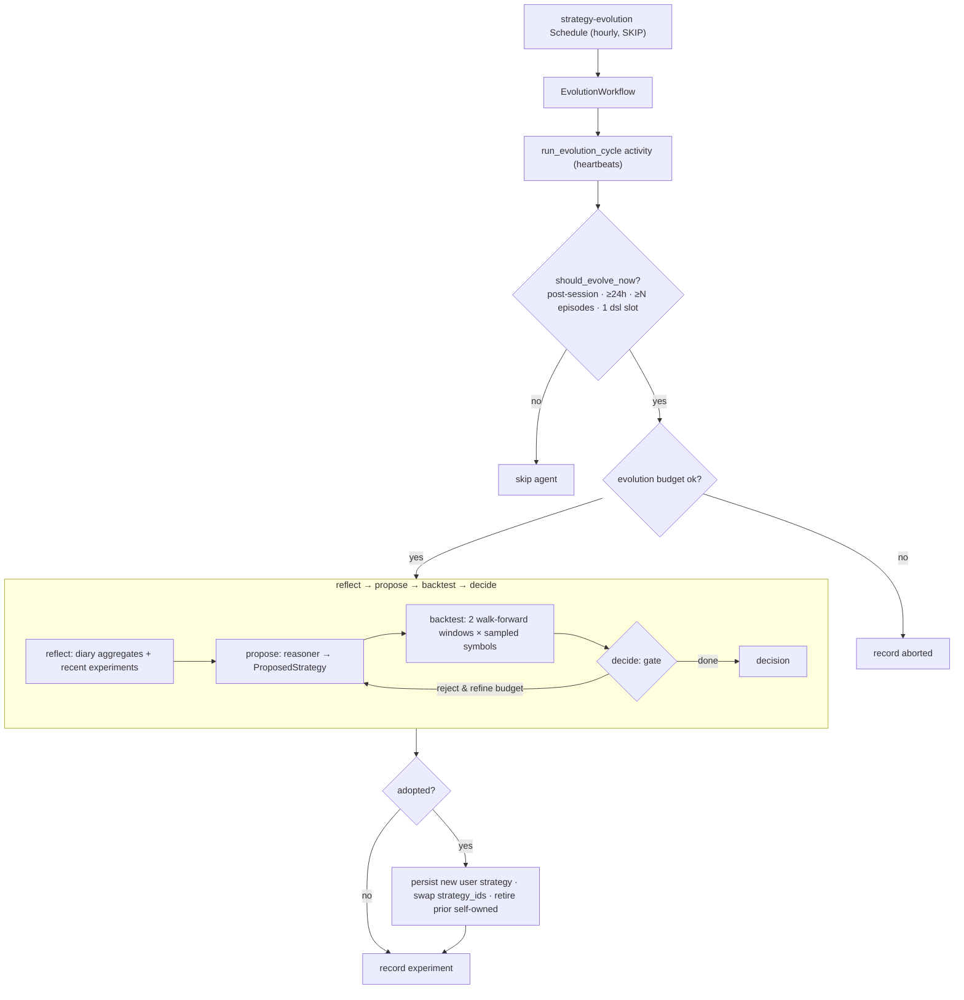

# 14 · Deep Agents — self-evolving strategies

Most of this system keeps the agents on *fixed* strategies: deterministic signal
generators the [LLM manages](07-agent-brain.md) but never changes. **Deep agents** add a
slow, separate loop where an agent **reflects on its own trading history, designs improved
`indicator_dsl` strategies, backtests them out-of-sample, and — if one genuinely beats its
current strategy — adopts it live.** It is the payoff of two earlier pieces: the
machine-composable [strategy grammar](05-trading-system.md) (#2) gives the agent something
it can *write*, and the [price archive](08-market-data.md) (#4a) gives it deep history to
*backtest on*.

Evolution never touches the [execution guardrails](07-agent-brain.md#the-guardrails-guardrailspy):
it changes *what* signals fire, never the risk ceiling. It is **OFF by default**
(`EVOLUTION_ENABLED=false`) and, when on, fully **autonomous but gated** — the model
proposes, deterministic code decides.

Source: `game-api/app/evolve/` (`workflow, graph, tools, proposal, compile, gate, trigger,
memory, budget, llm, diary`), the diary hooks in `agents/decision.py` + `agents/monitor.py`,
the shared grammar `neuromancing_shared/strategy_spec.py`, and trade-api's ad-hoc backtest.

### A note on the naming — "reanimations" and "constructs"

The UI and logs frame this loop as **necromancy**: an agent *raises* a new strategy from
the **ghosts of its own dead trades** (the closed [trade diary](#the-trade-diary--the-analysis-substrate)
episodes the reflect step reads), and if the candidate beats the incumbent out-of-sample it becomes
a live **construct** — otherwise it's *banished*. A superseded construct is *laid to rest*
(retired, not deleted, so it can be re-raised). This is voice, not mechanism — the mapping
is one-to-one and the underlying contract is unchanged:

| Framing | Mechanism |
|---|---|
| construct | an adopted, agent-owned evolved strategy (`owner_type=user`, `status=active`) |
| raise | adopt — swap the candidate into the agent's `indicator_dsl` slot (`decision=adopted`) |
| banish | reject — the candidate failed the gate (`decision=rejected`) |
| lay to rest | retire the prior self-owned construct (`status=retired`, revertible) |
| ghosts | the agent's closed trade-diary episodes the reflect step learns from |
| Reanimations (panel) | the agent's `strategy_experiment` history |

## Why it's safe to let an LLM evolve a trader

Three guarantees bound the blast radius, mirroring the project's "deterministic guardrails
between the model and execution" philosophy:

1. **The model only emits a validated grammar.** Candidates are `indicator_dsl` specs, run
   through the same fail-closed `validate_spec` as any other strategy — no code execution.
2. **A deterministic gate, not the model, decides adoption** — out-of-sample, on two
   walk-forward windows, with margin/min-trades/drawdown thresholds.
3. **Execution guardrails are unchanged.** Even a bad evolved strategy is still gated by the
   concentration/notional/signal-backed/stop-floor guardrails; `risk_profile` is off-limits
   to evolution this pass.

## The trade diary — the analysis substrate

Before an agent can learn, it needs a record of what it did. Every agent keeps a **trade
diary** (`game.trade_diary`, `evolve/diary.py`) — a **per-position-episode** log: one row per
open-from-flat → close-to-flat round trip of a symbol (so buy→buy→sell is one episode, not
three, matching the averaged `Position`).

- **Open** — written in `decision.py::apply_activity` when a filled buy leaves the symbol
  held: entry price (avg from the position), qty, the triggering signal, the LLM's rationale,
  and entry context.
- **Close** — finalized when the position returns to flat, from **both** exit sources: the
  deterministic [position monitor](04-decision-tick.md#the-position-monitor-deterministic-exits)
  (accurate stop/take/trailing price + realized P&L) and LLM-driven closes in `apply_activity`
  (exit ≈ mark). On close it computes `realized_pnl`, `return_pct`, `holding_secs`, and
  `outcome` (win/loss/flat).

Diary writes are **best-effort** (wrapped so they can never break a tick). The diary is kept
**always**, independent of whether evolution is enabled — so there is history to analyze from
day one. `diary.aggregates()` turns it into deterministic stats (win rate by symbol / by exit
reason, avg holding, best/worst) that ground the agent's reflection in numbers, not prose.

## When an agent evolves — the trigger

A singleton `strategy-evolution` Temporal Schedule fires `EvolutionWorkflow` **hourly**
(`ScheduleOverlapPolicy.SKIP`), but the real decision is a cheap per-agent gate,
`trigger.should_evolve_now`:

- **After the session closes, at most once per 24h.** Equity agents evolve once **today's
  session has closed** (read from the Alpaca calendar `market_hours` already caches);
  crypto-only agents (no session) evolve once/day at a configured UTC hour. The ≥24h guard
  makes it fire once per session.
- **Cold-start guard** — skip until the agent has ≥ `EVOLUTION_MIN_DIARY_EPISODES` closed
  episodes (don't evolve on noise).
- **Well-formed slot** — the agent must have **exactly one `indicator_dsl` strategy** (its
  "evolving slot"); 0 or >1 → skipped and logged (evolution never guesses which to replace).

So each agent assesses its just-finished session and *then* begins improvements.

## The evolution loop (LangGraph inside Temporal)

The matched agent runs `evolve_agent_activity` — a **heartbeating Temporal activity** that
runs a compiled **LangGraph** graph (`evolve/graph.py`). Temporal owns the schedule + outer
retry; LangGraph's **Postgres checkpointer** (`AsyncPostgresSaver`, thread_id =
`evolve:{agent}:{workflow_run_id}`) gives fine-grained **step resumption** — a retried or
restarted run resumes at the last completed node instead of re-paying for LLM + backtest
steps.

**Nodes:**

1. **reflect** — compute deterministic diary aggregates + the last few `strategy_experiment`
   rows, and (flash) a short qualitative digest. The model sees only *live* history (its own
   diary + recent live prices) — **never the backtest/holdout bars** (the overfitting guard).
2. **propose** — the reasoner designs 1–3 candidates. See [Structured output](#structured-output--pydantic-never-json).
3. **backtest** — the incumbent and each candidate are backtested over **two calendar
   windows** on a **sampled** subset of the agent's universe. See [Backtesting](#backtesting--walk-forward-out-of-sample).
4. **decide** — the deterministic [adoption gate](#the-adoption-gate). Reject → one bounded
   **refine** round (the reasoner sees the backtest feedback and tries again) → decide again.

The graph only *reasons and returns a decision*; the side-effecting **adoption** happens in
the workflow after the graph, keeping it idempotent (the last, safe step).

## Structured output — Pydantic, never JSON

The canonical `StrategySpec` has a *recursive* `buy_when`/`exit_when` (nestable all/any/not)
that is unreliable as a JSON-schema on Ollama's OpenAI-compat endpoint and would hand the LLM
a free-form object. So the reasoner emits a **flat, fully-typed `ProposedStrategy`**
(`evolve/proposal.py`) via `reasoner.with_structured_output(StrategyProposal,
method="function_calling")` — LangChain returns a validated **Pydantic object**, and
`compile_proposal` deterministically maps it to the canonical grammar and validates it
fail-closed. **No `json.loads` at the LLM boundary.** If a model can't produce structured
output, the pipeline falls back to a deterministic heuristic proposer (see
[dry-run](#dry-run--fail-safe)) — it never crashes. (This is the general
[Pydantic-structured-output rule](12-decisions.md).)

## Multi-model routing (Ollama Cloud only)

Two LangChain `ChatOpenAI` clients (`evolve/llm.py`), built exactly like the
[agent brain's](07-agent-brain.md#the-llm-management-layer-llmpy) client (same
`https://ollama.com/v1` endpoint, `max_retries=0`): a **strong reasoner**
(`OLLAMA_REASONING_MODEL`, longer 120s timeout since it runs in the heartbeating activity, not
the 75s decide path) for design/critique, and **flash** (`OLLAMA_MODEL`) for
reflection/compaction. Model names are read from config, never hardcoded. **Never Anthropic.**

## Backtesting — walk-forward, out-of-sample

Candidates are judged by trade-api's new **ad-hoc backtest** (`POST /strategies/backtest`,
service-token gated) which validates + backtests a spec **without persisting it**, so the
agent iterates freely. Key correctness rules (`evolve/tools.py`):

- **Each spec on its OWN timeframes** (`required_timeframes`) — a 5m strategy is judged on 5m
  data, a 1h/1d strategy on deeper history.
- **Two non-overlapping calendar windows** (a recent span + an earlier one via the backtest's
  `window {start,end}`, which reads a bounded Parquet slice). Window length scales to the
  *shallowest* required timeframe's archive depth (5m≈20d, 1h≈120d, 1d≈365d).
- **Sampled multi-symbol** (`EVOLUTION_BACKTEST_SYMBOLS`, aggregate — not one cherry-picked
  name), to bound cost and kill lucky single-fits.

The backtest itself is the same no-lookahead long/flat replay as any strategy
([05](05-trading-system.md)) — a *relative* incumbent-vs-candidate comparison over identical
spans, not an absolute P&L promise.

## The adoption gate

`gate.should_adopt` (pure, unit-tested) adopts the best candidate **iff**, on **both**
windows, it beats the incumbent's aggregate `total_return` by `EVOLUTION_RETURN_MARGIN`, has
≥ `EVOLUTION_MIN_TRADES`, and stays under `EVOLUTION_MAX_DD` — capped at **1 adoption/agent/
run**.

On adopt (`workflow._adopt`): a **new** strategy is persisted (`owner_type=user`,
`owner_ref=<handle>`, `status=active`, `version` bumped), the agent's single `indicator_dsl`
slot is swapped to it via a direct ORM write on the `game.agent` row (picked up on the **next
tick** — config is read fresh, no restart), and the prior slot is `retired` **only if it was
this agent's own earlier evolution** — a shared **house** strategy row is never mutated, just
unreferenced. Every run (adopt or not) writes a `game.strategy_experiment` row (hypothesis,
candidates, backtests, decision + reason) — the memory the next run reads.

## Resilience, budget, dry-run, no-chirp

- **Resilient execution** — Temporal retry + heartbeat (the graph is stepped with `astream`,
  heartbeating between nodes), LangGraph checkpoint resume, per-tool try/except, and
  fail-closed spec validation with a bounded fix-retry. Any error → the run is a **no-op**;
  the agent keeps its current strategies. One agent's failure can't break the cycle.
- **Budget** — a separate evolution token budget (`evolve/budget.py`,
  `LLM_DAILY_TOKEN_BUDGET_EVOLUTION`) so the expensive reasoner can't starve the trading loop;
  over-budget → no-op.
- **Dry-run / fail-safe** — with `EVOLUTION_ENABLED=false` (or no key), the propose node uses
  a deterministic heuristic proposer (nudge an incumbent parameter), so the full pipeline is
  exercisable headless and never blocks trading.
- **No Chirp** — evolution is **silent on the social feed**: the reflect/propose LLM has no
  `post_to_feed` tool and the loop writes no `agent_post`/social `feed_event`. Agents do not
  chirp about strategy changes — the only outward trace is the trader page.

## What you see on the trader page

The trader detail page ([10 · Web](10-web.md)) gains two read-only panels
(`GET /agents/{handle}/experiments` + `/diary`, behind the read token — the money-blind
boundary is intact): an **Evolution** panel (recent experiments: hypothesis · adopted/rejected
· metrics), a **Trade Diary** panel (recent closed episodes: entry→exit · P&L · exit reason ·
rationale), and an **"evolved" badge** on `owner_type=user` strategies in the config table.

## Configuration

All on game-api's `Settings` (`config.py`) + `.env.example`:

| Env | Default | Meaning |
|---|---|---|
| `EVOLUTION_ENABLED` | `false` | master switch (diary is kept regardless) |
| `OLLAMA_REASONING_MODEL` | *(empty→flash)* | strong reasoning model for design/critique |
| `OLLAMA_REASONING_TIMEOUT_S` | `120` | reasoner call timeout (runs in the evolve activity) |
| `LLM_DAILY_TOKEN_BUDGET_EVOLUTION` | `5_000_000` | separate evolution token cap |
| `EVOLUTION_SCHEDULE_SECONDS` | `3600` | how often the gate checks |
| `EVOLUTION_MIN_HOURS_BETWEEN` | `24` | ≥ this long between runs per agent |
| `EVOLUTION_CRYPTO_UTC_HOUR` | `0` | daily boundary for crypto-only agents |
| `EVOLUTION_MIN_DIARY_EPISODES` | `10` | cold-start guard |
| `EVOLUTION_MIN_TRADES` | `5` | min backtest trades to trust a candidate |
| `EVOLUTION_RETURN_MARGIN` | `0.02` | required edge over the incumbent |
| `EVOLUTION_MAX_DD` | `0.40` | reject candidates over this drawdown |
| `EVOLUTION_BACKTEST_SYMBOLS` | `6` | sample cap per run |

To turn it on: set `OLLAMA_REASONING_MODEL` to a capable Ollama Cloud model, set
`EVOLUTION_ENABLED=true`, and let agents accumulate ≥10 closed diary episodes.

---

See also: [05 · Trading system](05-trading-system.md) (the strategy grammar + backtest it
builds on), [08 · Market data](08-market-data.md) (the archive it backtests over),
[06 · Orchestration](06-orchestration.md) (the Temporal schedule/worker it registers with),
[07 · Agent brain](07-agent-brain.md) (the per-tick brain it complements), and
[03 · Data model](03-data-model.md) (`trade_diary` + `strategy_experiment`).
